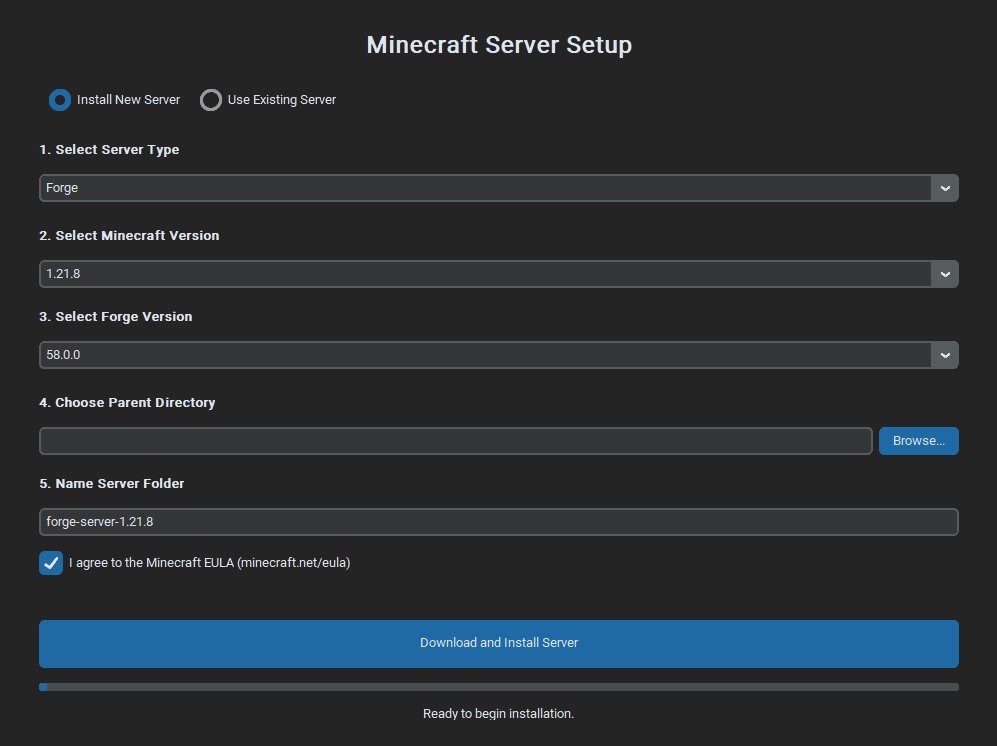
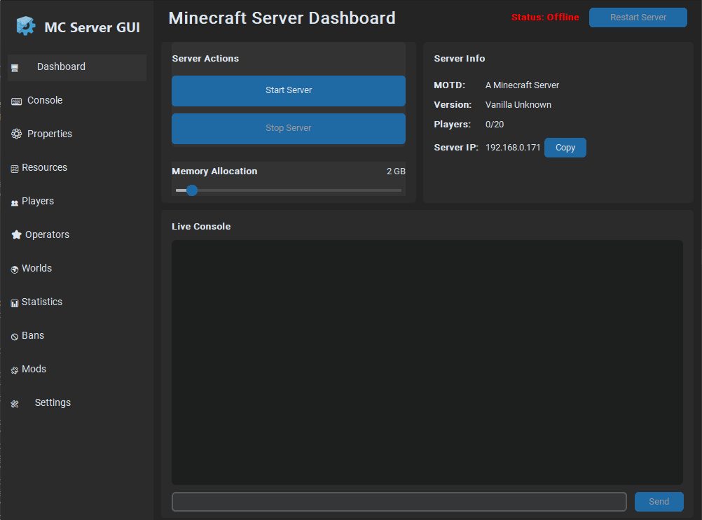

<div align="center">
  
  <h1>Minecraft Local Server GUI</h1>
</div>

A user-friendly desktop application for installing, managing, and running local Minecraft servers. Built with Python, this tool provides a complete graphical interface for server administration, from initial setup to daily management.

## Features

- **Easy Setup Wizard**:
  - **Install New Servers**: Download and set up a new server with just a few clicks. Supports **Vanilla, Paper, Spigot, Forge, and Fabric**.
  - **Use Existing Servers**: Easily import and manage a pre-existing server folder.
- **Complete Server Control**:
  - **One-Click Actions**: Start, Stop, and Restart the server directly from the GUI.
  - **Live Console**: View the live server console, with color-coded messages for errors and warnings.
  - **Command Input**: Send commands directly to the server through the interface.
- **Management Panels**:
  - **Properties Editor**: A graphical editor for `server.properties` with categorized, collapsible sections and helpful descriptions.
  - **Player Management**: View connected players with their avatars, op/de-op, kick, or ban them.
  - **Operators & Bans**: Manage server operators and banned players/IPs, with support for offline modifications.
  - **World Management**: View all world folders and create backups with a single click.
  - **Mod Management**: For Forge/Fabric, view installed mods, enable/disable them, view/edit their config files, and delete them.
- **Resource Monitoring**:
  - Live graphs showing the server's CPU and RAM usage over time.
- **Smart & Automated**:
  - **Automatic EULA Handling**: Automatically detects and accepts the EULA on the first run of a new server.
  - **Smart Startup**: Automatically uses the correct startup script (`run.bat`/`run.sh`) for Forge servers.
- **Customization & Settings**:
  - **Custom RAM Allocation**: Easily set the minimum and maximum RAM for your server.
  - **Configuration Saving**: Remembers your server path and settings between sessions.

## Screenshots

<div align="center">
  
  <p><em>Setup Wizard</em></p>
  <br>
  
  <p><em>Main Control Panel</em></p>
</div>

## Requirements

- **Python 3.x**: Must be added to your system's PATH.
- **Java**: You must have Java installed on your system for the application to run the Minecraft server JAR file.

---

## Installation & Usage

### For Windows Users (Recommended)

1.  Download or clone the repository.
2.  Simply double-click the **`run.bat`** file.
3.  The first time you run it, a setup process will automatically:
    - Create a Python virtual environment (`venv` folder).
    - Install all the required packages.
4.  After the initial setup, the script will launch the application directly.

### Manual Installation (All Platforms)

1.  **Clone the Repository**:
    ```sh
    git clone https://github.com/CalaKuad1/Minecraft-Local-Server-GUI.git
    cd Minecraft-Local-Server-GUI
    ```
2.  **Create and Activate a Virtual Environment**:
    ```sh
    # Create the virtual environment
    python -m venv venv

    # Activate it
    # On Windows:
    .\venv\Scripts\activate
    # On macOS/Linux:
    source venv/bin/activate
    ```
3.  **Install Dependencies**:
    ```sh
    pip install -r requirements.txt
    ```
4.  **Run the Application**:
    ```sh
    python main.py
    ```

---

## First-Time Setup

- The first time you run the app, a setup wizard will appear.
- Choose to **install a new server** (the app will download all necessary files) or **use an existing server folder**.
- Once configured, the main GUI will launch, and your settings will be saved for the next session.

## License

This project is licensed under the MIT License -- see the [LICENSE](LICENSE) file for details. 
