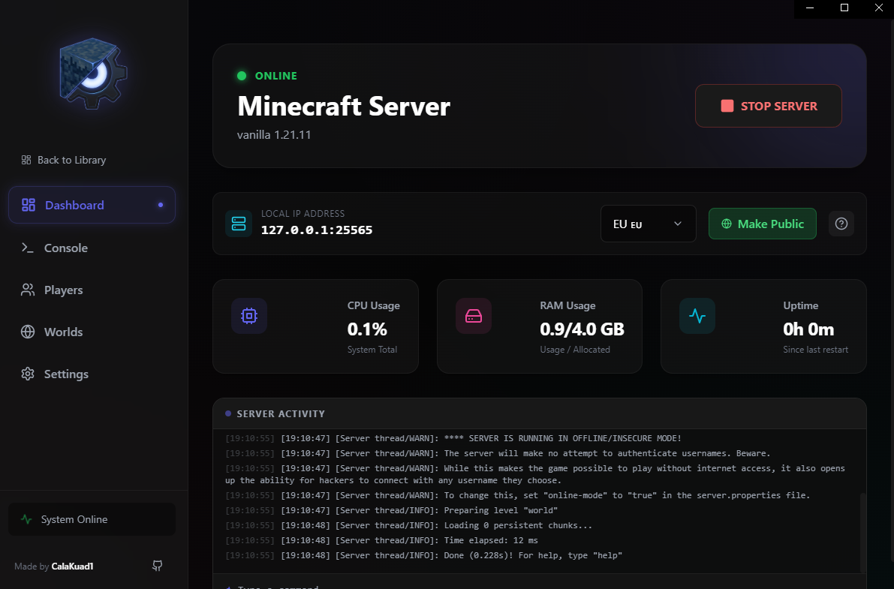

<div align="center">
  
  
  <h1>🎮 Minecraft Local Server GUI</h1>
  
  <p><strong>The ultimate tool for installing and managing Minecraft servers — beautiful, modern, and effortless.</strong></p>
  
  <p>
    <a href="https://github.com/CalaKuad1/Minecraft-Local-Server-GUI/releases/latest">
      
    </a>
  </p>
  
  <p>
    
    
    
    
  </p>

  <br>
  
  
</div>

---

## ⬇️ Download & Install

**One-click installation** — No Python or Java required!

| Platform | Download |
|:--------:|:---------|
| **Windows** | [📦 Download Installer (.exe)]([https://github.com/CalaKuad1/Minecraft-Local-Server-GUI/releases/latest/download/Minecraft%20Local%20Server%20GUI%20Setup%201.1.0.exe](https://github.com/CalaKuad1/Minecraft-Local-Server-GUI/releases/latest/download/Minecraft%20Local%20Server%20GUI%20Setup%201.1.0.exe)) |

> **Note:** The app automatically downloads and manages Java for you. Just install and play!

---

## ✨ Features

<table>
<tr>
<td width="50%">

### 🚀 Server Management
- **One-click server creation** — Vanilla, Paper, Spigot, Forge
- **Multiple server profiles** — Switch between servers instantly
- **Live console** with real-time logs and command input
- **Start/Stop controls** with visual status indicators

</td>
<td width="50%">

### ☕ Automatic Java
- **Zero configuration** — Java 8/17/21 downloaded automatically
- **Smart detection** — Matches Java version to Minecraft version
- **No more errors** — Eliminates `UnsupportedClassVersionError`
- **Isolated installations** — Won't affect your system Java

</td>
</tr>
<tr>
<td width="50%">

### 📊 Dashboard
- **Real-time stats** — CPU, RAM, and uptime monitoring
- **One-Click Public Server** — Use **Pinggy** (Experimental) to share your server globally via SSH tunnel
- **Region Selection** — Choose between EU, US, and Asia for best latency
- **Local IP display** — Easy LAN connection for friends
- **Quick command input** — Send commands from dashboard

### 🧩 Mods
- **Mod search & install** — browse mods and install them in one click
- **Installed mods list** — see what is currently installed
- **Smart warning for non-modded servers** — Vanilla/Paper show a hint to install a mod loader (Setup Wizard)

### 🌍 Worlds & Backups
- **World list** with last modified time
- **Fast loading** — world sizes are computed in the background and cached
- **One-click backups** — create ZIP backups and keep them inside your server folder

</td>
<td width="50%">

### ⚙️ Configuration
- **Visual settings editor** — No file editing required
- **server.properties GUI** — All options organized by category
- **RAM allocation** — Customize min/max memory per server
- **Player management** — Op, ban, whitelist with one click

### 👥 Players
- **Accurate online players** — player counter is tracked from server logs and `/list`
- **Cleaner console** — internal `/list` output is hidden from the console UI
- **Faster refresh** — avoids full UI reloads during periodic updates

</td>
</tr>
</table>

---

## 🎨 Modern UI

Built with **React** and **Tailwind CSS**, featuring:
- 🌙 **Dark theme** — Easy on the eyes
- ✨ **Glassmorphism** — Blurred, translucent panels
- 🎬 **Smooth animations** — Powered by Framer Motion
- 📱 **Responsive layout** — Scales to any window size

---

## 🔧 Tech Stack

| Layer | Technology |
|-------|------------|
| **Frontend** | Electron + React + Vite |
| **Styling** | Tailwind CSS + Framer Motion |
| **Backend** | Python + FastAPI + Uvicorn |
| **Packaging** | electron-builder (NSIS installer) |

---

## 🛠️ Development Setup

Want to contribute or run from source?

```bash
# Clone the repository
git clone https://github.com/CalaKuad1/Minecraft-Local-Server-GUI.git
cd Minecraft-Local-Server-GUI

# Backend setup
cd backend
python -m venv venv
venv\Scripts\activate  # Windows
pip install -r requirements.txt

# Frontend setup
cd ../electron-app
npm install

# Run in development mode
npm run dev
```

### Building the Installer

```bash
cd electron-app
npm run electron:build
# Output: electron-app/release/Minecraft Local Server GUI Setup 1.1.0.exe
```

---

## 📋 Requirements

### For Users (Installer)
- **Windows 10/11** (64-bit)
- **Internet connection** (for initial Java download)
- ~500MB disk space

### For Developers
- Node.js 18+
- Python 3.8+
- npm or yarn

---

## ❓ FAQ

<details>
<summary><strong>Why is it downloading Java?</strong></summary>

The app automatically downloads the correct Java version for your Minecraft server. This is sandboxed and won't affect your system Java installation.
</details>

<details>
<summary><strong>Can my friends connect to my server?</strong></summary>

For **LAN**: Share the Local IP shown in the dashboard.  
For **Internet**: Use a tunneling service like [playit.gg](https://playit.gg) (recommended) or configure port forwarding on your router.
</details>

<details>
<summary><strong>Is the UI available in English?</strong></summary>

Yes — the app UI and system messages are in **English**.
</details>

<details>
<summary><strong>Where are my servers stored?</strong></summary>

Server files are stored in the location you choose during setup. App configuration is saved in `%APPDATA%/MinecraftServerGUI`.
</details>

<details>
<summary><strong>How do I import an existing server?</strong></summary>

Click "Add Server" → "Use Existing" → Select your server folder. The app will auto-detect the server type and version.
</details>

---

## 📄 License

This project is licensed under the **MIT License** — see the [LICENSE](LICENSE) file for details.

---

## ⭐ Support

If this project helped you, please **star the repository** ⭐  
It helps others discover the tool and motivates development!

<div align="center">
  <br>
  <p>Made with ❤️ by <a href="https://github.com/CalaKuad1">CalaKuad1</a></p>
</div>
