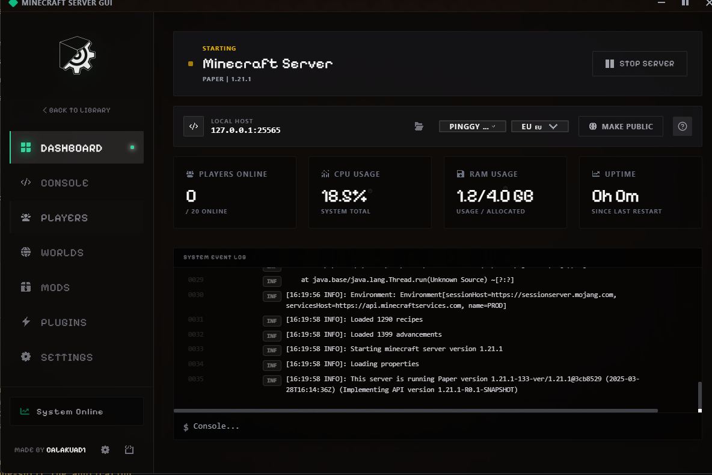

<div align="center">
  
  
  <h1>Minecraft Local Server GUI</h1>
  
  <p><strong>The ultimate tool for installing and managing Minecraft servers — beautiful, modern, and effortless.</strong></p>
  
  <p>
    <a href="https://github.com/CalaKuad1/Minecraft-Local-Server-GUI/releases/latest">
      
    </a>
    <a href="https://github.com/CalaKuad1/Minecraft-Local-Server-GUI/releases/latest">
      
    </a>
  </p>
  
  <p>
    
    
    
    
  </p>

  <br>
  
  
</div>

---

## What's New in v1.3.0

### Bedrock & Console Crossplay (GeyserMC)
- **Play with any device** — If GeyserMC is installed, the Dashboard detects it and shows a one-click **Bedrock Crossplay** panel. iOS, Android, Windows Bedrock, PlayStation, Xbox and Switch players can join your Java server.
- **No port forwarding** — A public UDP tunnel (Pinggy) is created automatically, and the address + port are shown with copy buttons.
- **Floodgate & port detection** — Floodgate is detected (badge) and the Bedrock port is read from Geyser's `config.yml`.
- **Safe & cancellable download** — The Pinggy CLI is downloaded on first use (Windows/macOS/Linux, x64/arm64) and verified against the official size + SHA-256 before running.
- **60-minute free tunnels** — Free Pinggy tunnels expire after ~60 minutes; restart from the Dashboard to renew.

### Stability & Fixes (PRs #17 & #18)
- **RAM fixed** — MB values now display correctly (512M → 0.5 GB) and RAM/Java settings are saved **per server** and applied without restarting.
- **Windows tunnel crash fixed** — The CLI output is now decoded as UTF-8 (`charmap` error).
- **Reliable internal API calls** — Status polling, tray and graceful shutdown now send the required token.
- **Safer window handling** — Minimize/maximize/close can't crash during teardown; auto-restart no longer swallows errors; preload listener leak fixed.
- **Better UX** — Force-stop confirmation localized (EN/ES/FR/RU), version dropdowns accept plain lists, and the lint/build pipeline is fixed.

<sub>Thanks to [@awtawsif](https://github.com/awtawsif) for PRs #17 and #18.</sub>

---

<details>
<summary><strong>What's New in v1.2.8 (previous)</strong></summary>

### Fixed a Massive Memory Leak
- **Backend no longer eats RAM** — an infinite loop in the Server List Ping code made the backend grow ~25-45 MB/s while a server was online (reaching 18 GB). It now stays around 70 MB.

### Security
- **Local API locked down** — every request now requires a per-launch token, and CORS is restricted to the app, so a malicious website can no longer control your server through localhost.

### Worlds & Backups
- **Full backup control** — restore, delete, download and upload backups.
- **Automatic backups** — schedule them by interval and choose how many to keep.

### Custom Address (DNS)
- **No more DNS quota errors** — the SRV record is created when the tunnel starts and removed when it stops/closes/is deleted, and the real error is shown if the DNS Worker fails.

### Console
- **Command history & autocomplete** — Up/Down history and Tab suggestions, plus logs that survive navigating back to the library.

### Fixes & UI
- Fixed the Schedule Shutdown crash, duplicate tunnels, the dead "Import World" button, icon 404s and log rotation.
- Redesigned the Server Library and translated Players/Worlds/Mods/Plugins into English, Spanish, French and Russian.
- **Auto-update** support, and builds now always ship the current backend.

</details>

<details>
<summary><strong>What's New in v1.2.7 (previous)</strong></summary>

### Fixed Server Installation (Paper/Spigot/Fabric)
- **Paper install fixed** — Installing Paper (and Spigot/Fabric) no longer fails with "Failed to download Server JAR." The server type is now lowercased before hitting the mcutils API, which returned HTTP 500 for capitalized types.
- **Reliable downloads** — Server JAR downloads now retry on transient CDN/Cloudflare errors with backoff, and the real failure reason (URL + status) is shown in the UI instead of a generic message.

### Fixed "Link to folder"
- **Import existing server works again** — The "Link Project" button in the Setup Wizard was silently broken (missing API method). It now detects the engine/version from your folder and registers the server, with loading and error feedback.

### Linux Memory Leak Fix
- **Massive RAM leak resolved** — On Linux, `api_server` could hold gigabytes after a server stopped. Log lines are now truncated before being stored in memory, the read buffer is reused, freed heap is returned to the OS via `malloc_trim`, and the backend no longer generates huge volumes of per-chunk debug log garbage.
- **Real log file now works** — `backend_debug.log` is now actually written (a logging setup bug previously sent everything to stderr).

</details>

<details>
<summary><strong>Earlier versions</strong></summary>

### What's New in v1.2.5

### Fixed Server Addresses (DNS)
- **Permanent domain** — Your server gets a permanent address like `survival.play.tudominio.app` that never changes
- **Auto-generated** — A unique subdomain is created automatically when the tunnel starts
- **Duplicate protection** — Subdomains are permanently reserved for your server, never released
- **Inline editing** — Edit your subdomain directly in the Dashboard with availability checking
- **Cloudflare DNS Proxy** — Open-source Worker manages SRV records (repo: `MLSG-DNS-Worker`)

### Console
- **Search & filter** — Search bar and level badges (CMD/INF/WRN/ERR)
- **Export logs** — Download console history as `.txt`
- **Always works** — REST API fallback when WebSocket is disconnected

### Dashboard
- **Premium/No Premium** — Quick online-mode toggle in the Dashboard header
- **Auto-restart on crash** — Toggle to auto-restart server on unexpected shutdown
- **Auto-Tunnel** — Tunnel starts automatically with the server (toggle in Advanced)
- **Boot from library** — "Boot" button on server cards in the library

### Auto-Restart on Crash
- Server automatically restarts after unexpected shutdowns — toggle it on/off from the Dashboard header
- Up to 3 restart attempts with a 3-second delay between retries

### Console Improvements
- **Export logs** — Download button saves the full console history as a `.txt` file
- **Search & filter** — Search bar and level filter (All/CMD/INF/WRN/ERR) for quick log navigation
- **Always usable input** — Console input stays enabled even when WebSocket is disconnected (REST API fallback)

### Stability Fixes
- **Logs persist across tab switches** — No more losing console logs when navigating between panels
- **Dashboard mini-console** — REST API fallback for sending commands when WebSocket is down
- **Connection status** — Clear "Disconnected" indicator instead of misleading "Loading..." state

---

<details>
<summary><strong>Earlier: v1.2.0 — UI Redesign & NeoForge</strong></summary>

### Complete UI Redesign
- **Pixel art icon system** — Custom 16x16 pixel icons throughout the entire UI
- **Visual effects** — Mouse spotlight, noise grain, magnetic buttons, abstract backgrounds
- **Server Library** — Redesigned grid view with search, recently opened, engine type icons

### NeoForge Support & Modpacks
- **NeoForge** as a new server engine + **Modpacks** tab for browsing and installing from Modrinth
- **Multi-Language (i18n)** — English, Spanish, French, and Russian with language selector in App Settings

</details>

</details>

---

## Download & Install

**One-click installation** — No Python or Java required!

| Platform | Download |
|:--------:|:---------|
| **Windows** | [Download Installer (.exe)](https://github.com/CalaKuad1/Minecraft-Local-Server-GUI/releases/latest) |
| **Linux** | [Download AppImage (.AppImage)](https://github.com/CalaKuad1/Minecraft-Local-Server-GUI/releases/latest) |

> **Note:** The app automatically downloads and manages Java for you. Just install and play!

---

## Features

<table>
<tr>
<td width="50%">

### Server Management
- **One-click server creation** — Vanilla, Paper, Spigot, Forge, **NeoForge**, Fabric
- **Multiple server profiles** — Switch between servers instantly
- **Live console** with real-time logs, search/filter, export, and command input
- **Auto-restart on crash** — Detects and restarts server automatically after unexpected shutdowns
- **Start/Stop controls** with visual status indicators
- **Server Conflict Guard** — Prevents running multiple servers simultaneously

</td>
<td width="50%">

### Automatic Java
- **Zero configuration** — Java 8/17/21 downloaded automatically
- **Smart detection** — Matches Java version to Minecraft version
- **No more errors** — Eliminates `UnsupportedClassVersionError`
- **Isolated installations** — Won't affect your system Java

</td>
</tr>
<tr>
<td width="50%">

### Dashboard
- **Real-time stats** — CPU, RAM, and uptime monitoring with sparkline graphs
- **Auto-restart** — Toggle to automatically restart server on crash (max 3 attempts)
- **Public Server** — Share your server globally via SSH tunnel (Pinggy)
- **Bedrock & Console Crossplay** — GeyserMC detection + one-click public UDP tunnel for iOS, Android and consoles
- **Fixed Address (DNS)** — Permanent domain via Cloudflare proxy (e.g. `survival.play.yourdomain.com`)
- **Region Selection** — EU, US, and Asia for best latency
- **Local IP display** — Easy LAN connection for friends
- **Quick command input** — Send commands from dashboard with WebSocket/REST fallback

### Mods & Modpacks
- **Mod search & install** — Browse and install mods from Modrinth
- **Modpacks** — Browse and install complete modpacks
- **Advanced filters** — Filter by loader, version, category, sort order
- **Smart warning** — Vanilla/Paper show a hint to install a mod loader

</td>
<td width="50%">

### Configuration
- **Visual settings editor** — No file editing required
- **server.properties GUI** — All options organized by category
- **RAM allocation** — Customize min/max memory with smart system limits
- **Player management** — Op, ban, whitelist with one click

### Multi-Language
- **4 languages** — English, Spanish, French, Russian
- **One-click switch** — Change language from App Settings

### Worlds & Backups
- **World list** with last modified time
- **Fast loading** — Sizes computed in background and cached
- **One-click backups** — ZIP backups inside your server folder

</td>
</tr>
</table>

---

## Modern UI

Built with **React** and **Tailwind CSS**, featuring:
- **Dark theme** — Deep, high-contrast dark design
- **Glassmorphism** — Blurred, translucent panels
- **Pixel art icons** — Custom Minecraft-inspired icon set
- **Smooth animations** — Powered by Framer Motion
- **Interactive effects** — Mouse spotlight, noise grain, magnetic buttons

---

## Tech Stack

| Layer | Technology |
|-------|------------|
| **Frontend** | Electron + React + Vite |
| **Styling** | Tailwind CSS + Framer Motion |
| **Backend** | Python + FastAPI + Uvicorn |
| **i18n** | Custom React Context (en/es/fr/ru) |
| **Packaging** | electron-builder (GitHub Actions CI/CD) |

---

## Development Setup

```bash
# Clone the repository
git clone https://github.com/CalaKuad1/Minecraft-Local-Server-GUI.git
cd Minecraft-Local-Server-GUI

# Backend setup
cd backend
python -m venv venv
venv\Scripts\activate  # Windows
pip install -r requirements.txt

# Frontend setup
cd ../electron-app
npm install

# Run in development mode
npm run dev
```

### Building the Installer (Production)

```bash
cd electron-app
npm run electron:build
```

**Automated Multi-platform Release**:
1. Bump version in `package.json`
2. Push a tag: `git tag v1.x.x && git push origin v1.x.x`
3. GitHub will build and publish everything automatically!

---

## Requirements

### For Users
- **Windows 10/11** (64-bit) or **Linux** (AppImage / .deb)
- **Internet connection** (for initial Java download)
- ~500MB disk space

### For Developers
- Node.js 18+
- Python 3.8+
- npm or yarn

---

## FAQ

<details>
<summary><strong>Why is it downloading Java?</strong></summary>

The app automatically downloads the correct Java version for your Minecraft server. This is sandboxed and won't affect your system Java installation.
</details>

<details>
<summary><strong>Can my friends connect to my server?</strong></summary>

For **LAN**: Share the Local IP shown in the dashboard.  
For **Internet**: Use the built-in **Public Server** tunnel (Pinggy) from the Dashboard, or configure port forwarding on your router.
</details>

<details>
<summary><strong>Is the UI available in other languages?</strong></summary>

Yes — the app UI is available in **English, Spanish, French, and Russian**. You can switch languages from App Settings.
</details>

<details>
<summary><strong>Where are my servers stored?</strong></summary>

Server files are stored in the location you choose during setup. App configuration is saved in `%APPDATA%/MinecraftServerGUI`.
</details>

<details>
<summary><strong>How do I import an existing server?</strong></summary>

Click "Add Server" in the Library, then select your server folder. The app will auto-detect the server type and version.
</details>

<details>
<summary><strong>Where is app data stored on Linux?</strong></summary>

On Linux, all app data is stored in `~/.minecraft_server_gui/`. On Windows, it's in `%APPDATA%/MinecraftServerGUI`.
</details>

---

## License

This project is licensed under the **MIT License** — see the [LICENSE](LICENSE) file for details.

---

## Support

If this project helped you, please **star the repository**  
It helps others discover the tool and motivates development!

<div align="center">
  <br>
  <p>Made with love by <a href="https://github.com/CalaKuad1">CalaKuad1</a></p>
</div>
