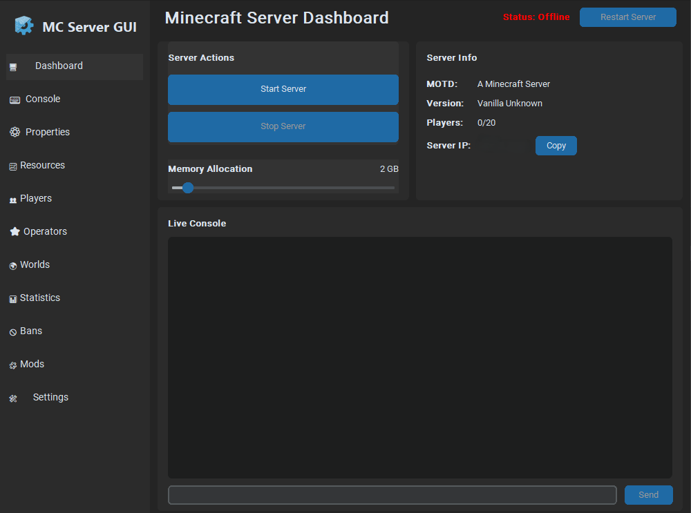

<div align="center">
  
  <h1>Minecraft Local Server GUI</h1>
  
  <p><strong>🎮 La herramienta definitiva para gestionar servidores de Minecraft locales</strong></p>
  
  <p>Una aplicación de escritorio intuitiva que automatiza completamente la instalación, configuración y gestión de servidores de Minecraft. Con gestión automática de Java, interfaz gráfica moderna y soporte completo para todos los tipos de servidores.</p>
  
  <p>
    
    
    
    
  </p>
</div>

## 🚀 Características Principales

### ⚡ **NUEVO: Gestión Automática de Java**
- **🎯 Detección Inteligente**: Detecta automáticamente qué versión de Java necesita cada versión de Minecraft
- **📦 Descarga Automática**: Descarga e instala Java 8, 17 o 21 según sea necesario
- **🔗 Configuración por Servidor**: Cada servidor usa automáticamente su versión de Java correcta
- **❌ Adiós a los Errores**: Elimina completamente los errores de "UnsupportedClassVersionError"

### 🛠️ **Instalación y Configuración Sin Esfuerzo**
- **Asistente de Instalación**: Descarga y configura servidores con unos pocos clics
- **Soporte Universal**: Compatible con **Vanilla, Paper, Spigot, Forge y Fabric**
- **Importación Fácil**: Importa y gestiona servidores existentes automáticamente
- **Configuración Inteligente**: Detecta automáticamente versiones y configura Java apropiado

## 🌟 Características Completas

### 🎮 **Control Total del Servidor**
- **🚀 Acciones de Un Clic**: Inicia, detén y reinicia servidores directamente desde la interfaz
- **📺 Consola en Vivo**: Ve los logs del servidor en tiempo real con colores para errores y advertencias
- **⌨️ Entrada de Comandos**: Envía comandos directamente al servidor desde la interfaz
- **📊 Monitoreo de Recursos**: Gráficos en tiempo real de uso de CPU y RAM

### 👥 **Gestión Avanzada de Jugadores**
- **🖼️ Lista Visual**: Ve jugadores conectados con sus avatares de Minecraft
- **⭐ Gestión de Operadores**: Otorga/quita permisos de administrador fácilmente
- **🚫 Sistema de Baneos**: Banea jugadores o IPs con soporte para modificaciones offline
- **📈 Estadísticas**: Ve estadísticas detalladas de cada jugador

### ⚙️ **Configuración Intuitiva**
- **🎛️ Editor de Propiedades**: Editor gráfico para `server.properties` con secciones organizadas
- **🌍 Gestión de Mundos**: Ve todas las carpetas de mundos y crea backups con un clic
- **🧩 Gestión de Mods**: Para Forge/Fabric - habilita/deshabilita mods, edita configuraciones
- **💾 Configuración Persistente**: Recuerda todas tus configuraciones entre sesiones

### 🌐 **Funciones Avanzadas**
- **🔗 Hacer Público (Experimental)**: Expone tu servidor local a internet con un clic
- **🤖 Manejo Automático de EULA**: Acepta automáticamente el EULA en la primera ejecución
- **🎯 Inicio Inteligente**: Usa automáticamente scripts de inicio correctos para servidores Forge
- **🔧 Asignación de RAM Personalizada**: Configura fácilmente RAM mínima y máxima

### 🛡️ **Seguridad y Estabilidad**
- **✅ Validación Automática**: Verifica configuraciones antes de aplicar cambios
- **🔄 Recuperación de Errores**: Manejo inteligente de errores y recuperación automática
- **📝 Logs Detallados**: Sistema de logging completo para diagnóstico de problemas

## Screenshots

<div align="center">
  
  <p><em>Setup Wizard</em></p>
  <br>
  
  <p><em>Main Control Panel</em></p>
</div>

## 📋 Requisitos del Sistema

- **Python 3.7+**: Debe estar instalado y agregado al PATH del sistema
- **Java**: ⚡ **¡YA NO ES NECESARIO!** - La aplicación descarga e instala automáticamente las versiones de Java necesarias
- **Conexión a Internet**: Para descargas de servidores y Java (solo durante la configuración inicial)
- **Espacio en Disco**: ~500MB para instalaciones de Java + espacio para servidores

---

## 🚀 Instalación y Uso

### 🎯 Inicio Rápido (Recomendado)

#### Para Windows:
1. **Descarga** el proyecto desde GitHub (botón verde "Code" → "Download ZIP")
2. **Extrae** el archivo ZIP en tu carpeta preferida
3. **Ejecuta** `run.bat` (doble clic)
4. **¡Listo!** La aplicación se instalará y ejecutará automáticamente

#### Para macOS/Linux:
1. **Clona o descarga** el repositorio:
   ```bash
   git clone https://github.com/tu-usuario/Minecraft-Local-Server-GUI.git
   cd Minecraft-Local-Server-GUI
   ```
2. **Instala dependencias y ejecuta**:
   ```bash
   python3 -m venv venv
   source venv/bin/activate
   pip install -r requirements.txt
   python main.py
   ```

### 🔧 Instalación Manual (Avanzada)

Si prefieres instalar manualmente o tienes problemas con el instalador automático:

1. **Clona el repositorio**:
   ```bash
   git clone https://github.com/CalaKuad1/Minecraft-Local-Server-GUI.git
   cd Minecraft-Local-Server-GUI
   ```

2. **Crea un entorno virtual**:
   ```bash
   python -m venv venv
   
   # Actívalo:
   # Windows:
   .\venv\Scripts\activate
   # macOS/Linux:
   source venv/bin/activate
   ```

3. **Instala las dependencias**:
   ```bash
   pip install -r requirements.txt
   ```

4. **Ejecuta la aplicación**:
   ```bash
   python main.py
   ```

---

## 🎮 Primer Uso

### 🧙‍♂️ Asistente de Configuración
1. **Primera ejecución**: Aparecerá un asistente de configuración intuitivo
2. **Elige tu opción**:
   - **🆕 Instalar Servidor Nuevo**: La app descarga y configura todo automáticamente
   - **📁 Usar Servidor Existente**: Importa una carpeta de servidor existente
3. **⚡ Magia de Java**: La aplicación detecta automáticamente la versión de Minecraft y descarga el Java correcto
4. **🚀 ¡Listo!**: La interfaz principal se abre y tus configuraciones se guardan para la próxima vez

## ☕ Sistema de Gestión de Java

### 🎯 ¿Qué Problema Resuelve?
**Antes**: `UnsupportedClassVersionError: class file version 65.0, this version only recognizes up to 61.0`
**Ahora**: ✅ **Funciona automáticamente sin errores**

### 🛠️ Cómo Funciona
- **🔍 Detección Automática**: Identifica la versión de Minecraft de tu servidor
- **📦 Descarga Inteligente**: Obtiene la versión de Java correcta desde Eclipse Adoptium
- **🔗 Vinculación Automática**: Cada servidor usa su Java apropiado
- **💾 Gestión Eficiente**: Reutiliza instalaciones entre servidores compatibles

### 📊 Compatibilidad de Versiones
| Versión de Minecraft | Java Requerido | Estado |
|---------------------|----------------|---------|
| 1.21+ | Java 21 | ✅ Descarga automática |
| 1.20.5 - 1.20.6 | Java 21 | ✅ Descarga automática |
| 1.17 - 1.20.4 | Java 17 | ✅ Sistema o descarga |
| 1.16.5 y anteriores | Java 8 | ✅ Sistema o descarga |

### 🎉 Beneficios
- **❌ Cero errores de compatibilidad** - Cada servidor usa su Java correcto
- **🚀 Instalación automática** - No necesitas instalar Java manualmente
- **🔄 Múltiples versiones** - Mantiene Java 8, 17 y 21 simultáneamente
- **🧠 Detección inteligente** - Reconoce versiones de Minecraft automáticamente

## ❓ Preguntas Frecuentes

### 🔧 **Problemas de Instalación**

**P: ¿Qué hago si Python no está instalado?**
R: Descarga Python desde [python.org](https://python.org) y asegúrate de marcar "Add Python to PATH" durante la instalación.

**P: ¿El instalador automático no funciona?**
R: Usa la instalación manual o verifica que tienes permisos de administrador.

### ☕ **Problemas de Java**

**P: ¿Qué pasa si tengo Java instalado pero sigue descargando más?**
R: La aplicación descarga versiones específicas para garantizar compatibilidad. Esto es normal y beneficioso.

**P: ¿Puedo usar mi Java existente?**
R: Sí, si tu Java es compatible, la aplicación lo detectará y usará automáticamente.

### 🎮 **Problemas de Servidores**

**P: ¿Mi servidor no inicia?**
R: Verifica los logs en la consola. La aplicación mostrará errores específicos y sugerencias.

**P: ¿Cómo importo un servidor existente?**
R: Usa "Usar Servidor Existente" en el asistente y selecciona la carpeta de tu servidor.

### 🌐 **Función "Hacer Público"**

**P: ¿Es seguro hacer público mi servidor?**
R: La función usa un servicio de túnel público. Úsala solo con amigos de confianza y considera configurar whitelist.

**P: ¿Por qué la dirección pública cambia cada vez?**
R: Es normal con servicios de túnel gratuitos. La dirección se genera dinámicamente.

## 🐛 Solución de Problemas

### 🔍 **Diagnóstico Rápido**
1. **Verifica Python**: `python --version` debe mostrar 3.7+
2. **Verifica permisos**: Ejecuta como administrador si hay problemas
3. **Revisa logs**: La consola de la aplicación muestra errores detallados
4. **Reinicia la aplicación**: Muchos problemas se resuelven con un reinicio

### 📞 **Obtener Ayuda**
- **Issues de GitHub**: Reporta bugs o solicita características
- **Logs detallados**: Incluye siempre los logs al reportar problemas
- **Información del sistema**: Menciona tu OS, versión de Python y Java

## 🤝 Contribuir

¡Las contribuciones son bienvenidas! Por favor:
1. Fork el repositorio
2. Crea una rama para tu característica (`git checkout -b feature/AmazingFeature`)
3. Commit tus cambios (`git commit -m 'Add some AmazingFeature'`)
4. Push a la rama (`git push origin feature/AmazingFeature`)
5. Abre un Pull Request

## 📄 Licencia

Este proyecto está licenciado bajo la Licencia MIT - ve el archivo [LICENSE](LICENSE) para más detalles.

## 📝 Historial de Cambios

### 🆕 Versión 2.0.0 - Revolución de Gestión de Java

**Características Nuevas:**
- ⚡ **Gestión Automática de Java**: Detecta y descarga automáticamente las versiones correctas
- 🎮 **Detección Inteligente**: Identifica versiones de Minecraft desde archivos JAR
- 📦 **Multi-Java**: Mantiene Java 8, 17 y 21 simultáneamente
- 🔗 **Configuración por Servidor**: Cada servidor usa su Java apropiado automáticamente

**Problemas Resueltos:**
- ❌ **CRÍTICO**: Eliminado "UnsupportedClassVersionError" para versiones nuevas de Minecraft
- 🔧 Resueltos problemas de detección de Java en diferentes sistemas
- 🚀 Corregidos fallos de inicio con versiones incompatibles

## ⭐ ¿Te Gusta el Proyecto?

Si este proyecto te ha sido útil, ¡considera darle una estrella en GitHub! ⭐

Esto ayuda a otros usuarios a encontrar la herramienta y motiva el desarrollo continuo.

---

<div align="center">
  <p><strong>🎮 Minecraft Server GUI - La herramienta definitiva para servidores locales</strong></p>
  <p>Con gestión automática de Java • Sin configuración manual • Compatible con todas las versiones</p>
</div> 
